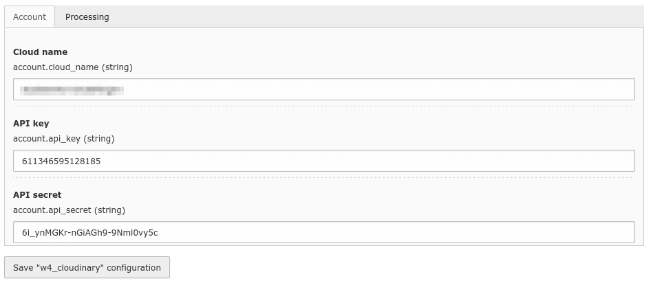
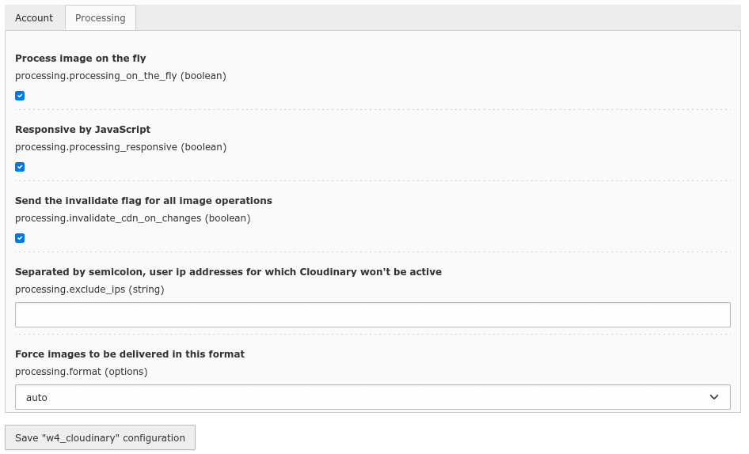
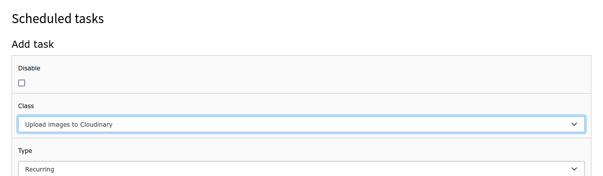

.. include:: /Includes.rst.txt

.. _configuration:

=============
Configuration
=============

The extension is configured in :guilabel:`Settings > Extension Configuration > Configure extensions`:

|
.. list-table:: Explanation
   :header-rows: 1

   * - Field
     - Description
   * - Cloud name
     - Your Cloudinary account name
   * - API key
     - Cloudinary API key
   * - API secret
     - Cloudinary API secret

|
.. list-table:: Explanation
   :header-rows: 1

   * - Field
     - Description
   * - Process image on the fly
     - If checked, images will be uploaded to Cloudinary immediatelly after something has been done with them in the :guilabel:`Filelist` : uploaded, renamed, or moved. Also, if deleted it will be immediatelly deleted in Cloudinary. If not checked, a task has to be scheduled to update Cloudinary with the images added, modified or deleted after its previous run
   * - Responsive by JavaScript 
     - If checked, the :guilabel:`src` of the images will be dinamically set via JavaScript, and Cloudinary will serve an image optimized for each device
   * - Send the invalidate flag for all image operations
     - If checked, when an image has been updated Cloudinary will clear its cache (usually files are cached for 30 days)
   * - Separated by semicolon, user ip addresses for which Cloudinary won't be active
     - List of ip addresses for which this extension won't do anything
   * - Force images to be delivered in this format 
     - By default auto (Cloudinary will deliver the images in webp format), but if desired it can be changed to png, jpg or gif

Scheduled task
==============

If images are not processed on the fly, a task of the class "Upload images to Cloudinary" has to be scheduled:

|
The task will update Cloudinary with any changes occurred in the :guilabel:`Filelist` after its previous run.
